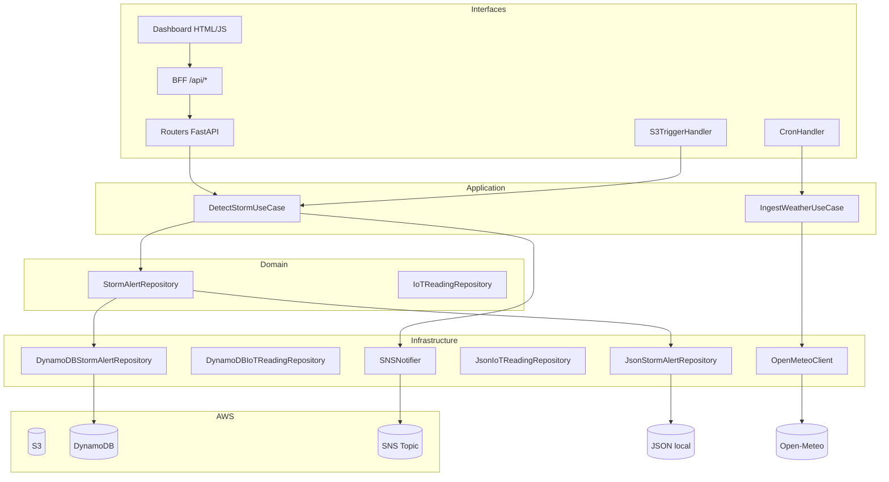

# Architecture

**Project:** global-solution-2s
**Mapped on:** 2026-06-05 (v2 — Clean Architecture com Ports & Adapters)

---

## Overview

Arquitetura modular em Python com backend FastAPI, execução local via Uvicorn e execução em nuvem via AWS Lambda (Mangum). Adota Clean Architecture enxuta em 4 camadas: Domain → Application → Infrastructure → Interfaces. Dependências apontam sempre para dentro; a camada Domain não importa boto3, fastapi ou flask.

---

## Camadas

```
┌─────────────────────────────────────────────────────┐
│  Interfaces (HTTP routers, BFF, Lambda event handlers) │
├─────────────────────────────────────────────────────┤
│  Application (Use Cases: DetectStormUseCase, ...)    │
├─────────────────────────────────────────────────────┤
│  Domain (Protocols/Ports — contratos puros, zero I/O)│
├─────────────────────────────────────────────────────┤
│  Infrastructure (AWS adapters, JSON mock, clients)   │
└─────────────────────────────────────────────────────┘
```

| Camada | Diretório | Tecnologia | Pode importar |
|--------|-----------|------------|---------------|
| Domain | `app/domain/` | Python puro | nada externo |
| Application | `app/application/` | Python | domain |
| Infrastructure | `app/infrastructure/` | boto3, requests | domain |
| Interfaces HTTP | `app/routers/`, `app/interfaces/http/` | FastAPI | application, domain |
| Interfaces Events | `app/interfaces/events/` | Mangum | application |
| Dashboard UI | `dashboard/` | Flask/HTML/JS | interfaces/http/bff |

---

## Estrutura de diretórios

```text
src/app/
├── core/                      # config (pydantic-settings), logging
├── domain/                    # contratos puros (Protocols)
│   ├── cv/ports.py            # StormAlertRepository
│   └── iot/ports.py           # IoTReadingRepository
├── infrastructure/            # implementações de I/O
│   ├── aws/
│   │   ├── dynamodb_storm.py  # DynamoDBStormAlertRepository
│   │   └── dynamodb_iot.py    # DynamoDBIoTReadingRepository
│   └── persistence/
│       ├── json_storm_store.py # JsonStormAlertRepository
│       └── json_iot_store.py   # JsonIoTReadingRepository
├── application/               # use cases (orquestração sem I/O direto)
│   └── cv/
│       └── detect_storm.py    # DetectStormUseCase
├── interfaces/                # entrada de dados
│   ├── events/
│   │   └── s3_trigger.py      # S3TriggerHandler (Lambda event)
│   └── http/
│       └── bff/
│           ├── handlers.py    # lógica BFF (antes em dashboard/)
│           └── backend.py     # cliente HTTP interno
├── container.py               # factory / DI (escolhe mock vs DynamoDB)
├── clients/                   # clientes HTTP externos (openmeteo, inmet)
├── models/schemas.py          # Pydantic request/response schemas
├── routers/                   # endpoints HTTP (thin layer)
│   ├── cv.py                  # delega para DetectStormUseCase
│   ├── iot.py                 # usa Depends(get_iot_repo)
│   ├── dashboard_bff.py       # /api/* — importa de interfaces/http/bff
│   └── ...
├── services/                  # services legados + domain services
│   ├── weather_service.py
│   ├── agri_risk_model.py
│   ├── risk_assessment.py
│   ├── alerts_analytics.py
│   ├── storm_alerts_query.py
│   └── storm_detector.py
└── main.py                    # wiring FastAPI + Mangum handler
```

---

## Diagrama de fluxo



---

## Bounded Contexts

| Contexto | Dono sugerido | Domain | Infra AWS |
|----------|---------------|--------|-----------|
| CV / Storms | Lucas | `domain/cv/` | S3, Lambda, DynamoDB, SNS |
| Weather | Caroline | `services/weather_service.py` | DynamoDB, CloudWatch |
| ML / Risk | Caroline + Lucas | `services/agri_risk_model.py` | DynamoDB |
| IoT | Rodrigo | `domain/iot/` | API Gateway, DynamoDB |
| Dashboard | Caroline + Enzo | `interfaces/http/bff/` | — |
| Infra/Deploy | Tiago | `infrastructure/aws/` | Todos |

---

## Dependency Injection

Container em `app/container.py` — escolhe adapter com base em `settings.DYNAMODB_USE_MOCK`:

```python
def get_storm_repo() -> StormAlertRepository:
    return JsonStormAlertRepository() if settings.DYNAMODB_USE_MOCK
           else DynamoDBStormAlertRepository()
```

Routers recebem via `Depends(get_storm_repo)`. Testes injetam mocks diretamente.

---

## Entry Points

| Entry | Path | Description |
|-------|------|-------------|
| API app | `src/app/main.py` | FastAPI + Lambda handler |
| CV use case | `src/app/application/cv/detect_storm.py` | YOLO + SNS + persist |
| S3 trigger | `src/app/interfaces/events/s3_trigger.py` | Evento S3 → use case |
| Weather Lambda | `src/app/lambdas/ingest_weather.py` | Ingestão periódica |
| Dashboard | `src/dashboard/app.py` | Flask UI (dev local) |
| BFF | `src/app/interfaces/http/bff/handlers.py` | Lógica de agregação |

---

## Key Architectural Decisions

| Decision | Rationale | Trade-offs |
|----------|-----------|-----------|
| Ports & Adapters para repositórios | Testes sem AWS; troca DynamoDB ↔ mock via config | Mais arquivos |
| DetectStormUseCase em `application/` | cv.py fica só HTTP; testável sem FastAPI | Migração incremental |
| Container manual (sem framework DI) | Simples; compatível com FastAPI Depends | Não auto-wires |
| BFF em `interfaces/http/bff/` | Separa dashboard UI da lógica de agregação | Shims temporários em dashboard/ |
| Um único Lambda no MVP | Deploy simples; custo zero extra | Cold start pesado com YOLO |
