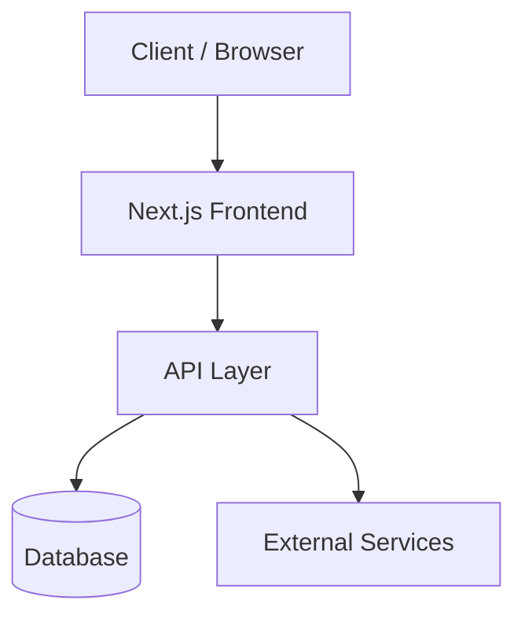

# Architecture

**Project:** [Project Name]
**Mapped on:** [YYYY-MM-DD]

---

## Overview

[1-3 sentence description of the high-level architecture pattern — e.g., "Monorepo with a Next.js frontend consuming a REST API built on Express. Data layer uses PostgreSQL via Prisma ORM."]

---

## Architecture Diagram



> Replace with your actual architecture diagram.

---

## Layers

| Layer | Technology | Responsibility |
|-------|-----------|----------------|
| Presentation | [e.g., Next.js pages/app] | UI rendering, routing |
| API | [e.g., API routes / Express] | Business logic, validation |
| Data access | [e.g., Prisma] | Database queries, models |
| Domain / Services | [e.g., src/services/] | Core business rules |

---

## Data Flow

[Describe how data moves through the system — from user action to persistence and back.]

```
User Action → [Component] → [API Route] → [Service] → [Repository] → [Database]
                                                      ↑
                                              [External Service]
```

---

## Key Architectural Decisions

| Decision | Rationale | Trade-offs |
|----------|-----------|-----------|
| [e.g., Monorepo] | [why] | [pros/cons] |
| [e.g., Server components] | [why] | [pros/cons] |

---

## Boundaries & Rules

- [Rule: e.g., "Services NEVER import from pages — data flows one way"]
- [Rule: e.g., "All DB access goes through the repository layer"]
- [Rule: e.g., "No business logic in components"]

---

## Entry Points

| Entry | Path | Description |
|-------|------|-------------|
| App root | `src/app/` | Next.js app router root |
| API | `src/app/api/` | API routes |
| Services | `src/services/` | Business logic |
| DB Models | `prisma/schema.prisma` | Data model |
