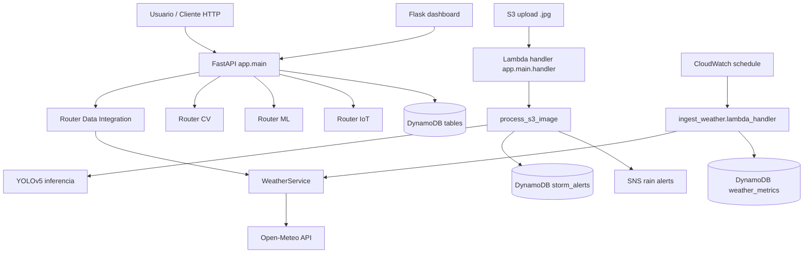

# Architecture

**Project:** global-solution-2s
**Mapped on:** 2026-06-04

---

## Overview

Arquitetura modular em Python com backend FastAPI, execucao local via Uvicorn e execucao em nuvem via AWS Lambda (Mangum). O projeto combina tres fluxos principais: ingestao meteorologica (Open-Meteo), deteccao de tempestade por YOLO (S3 trigger) e exposicao de endpoints para dashboard/API.

---

## Architecture Diagram

---

## Layers

| Layer | Technology | Responsibility |
|-------|-----------|----------------|
| Presentation | Flask dashboard + API clients | Visualizacao local e consumo de endpoints |
| API | FastAPI routers | Contratos HTTP, validacoes e orquestracao |
| Domain services | app/services | Regras de negocio (clima, risco, deteccao) |
| Integration | boto3 + HTTP clients | S3/SNS/DynamoDB e APIs externas |
| Infrastructure | AWS Lambda + API Gateway + S3 + DynamoDB | Execucao serverless e persistencia |

---

## Data Flow

### Fluxo A: API de clima e risco

Cliente -> endpoint `/weather/current` ou `/risk/forecast` -> validacao de coordenadas -> `WeatherService`/`RiskAssessmentService` -> Open-Meteo -> resposta JSON.

### Fluxo B: Deteccao CV via S3 trigger

Upload `.jpg` no S3 -> evento S3 chama `handler` -> `process_s3_image` -> download da imagem + modelo -> inferencia YOLO -> se houver deteccao: publica SNS e grava no DynamoDB.

### Fluxo C: Ingestao periodica de clima

CloudWatch schedule -> `ingest_weather.lambda_handler` -> coleta multiplas coordenadas no Open-Meteo -> normaliza payload -> grava em DynamoDB com TTL.

---

## Key Architectural Decisions

| Decision | Rationale | Trade-offs |
|----------|-----------|-----------|
| FastAPI + Mangum para Lambda | Reaproveita API local e cloud com o mesmo codigo | Cold start pode ser alto com dependencias pesadas |
| YOLOv5 em pipeline serverless | Boa acuracia para deteccao de objetos em imagens | Peso do modelo e runtime elevam custo/latencia |
| DynamoDB para dados operacionais | Simples, serverless e sem manutencao de banco | Consultas analiticas complexas ficam mais dificeis |
| Dashboard Flask separado | Entrega rapida para visualizacao | Duplica camada de apresentacao fora da API |
| Configuracao por pydantic-settings | Centraliza env vars e evita hardcode | Requer disciplina de setup .env por ambiente |

---

## Boundaries & Rules

- Routers devem orquestrar; logica de negocio fica em `app/services`.
- Credenciais e parametros de ambiente devem vir de `app/core/config.py`.
- Integracoes AWS devem usar boto3 com regiao explicitada por settings.
- Eventos S3 e requests HTTP compartilham entrypoint em `app/main.py`.

---

## Entry Points

| Entry | Path | Description |
|-------|------|-------------|
| API app | `src/app/main.py` | Instancia FastAPI, routers, CORS e handler Lambda |
| CV pipeline | `src/app/routers/cv.py` | Deteccao em imagem S3, alerta SNS e persistencia |
| Data integration API | `src/app/routers/data_integration.py` | Endpoints weather/storm/risk/map |
| Weather Lambda | `src/app/lambdas/ingest_weather.py` | Ingestao periodica para DynamoDB |
| Dashboard | `src/dashboard/app.py` | Frontend Flask local |
