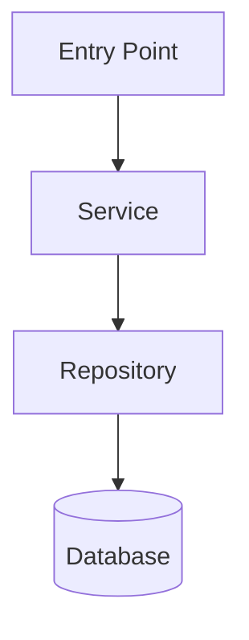

# [Feature Name] Design

**Feature:** `[feature-slug]`
**Spec:** `.specs/features/[feature-slug]/spec.md`
**Created:** [YYYY-MM-DD]
**Status:** Draft | Approved | Superseded

---

## Architecture Overview

[1-3 sentence description of how this feature is implemented architecturally.]



---

## Components

| Component | Type | Location | Responsibility |
|-----------|------|---------|----------------|
| [ComponentName] | React component | `src/components/[path]` | [what it does] |
| [ServiceName] | Service | `src/services/[path]` | [what it does] |
| [RepositoryName] | Repository | `src/repositories/[path]` | [what it does] |
| [ApiRoute] | API Route | `src/app/api/[path]` | [what it does] |

---

## Data Model

### New / Modified Schemas

```typescript
// [entity name]
type [EntityName] = {
  id: string
  // add fields...
}
```

### Database Changes

- [ ] New table: `[table_name]`
- [ ] Modified table: `[table_name]` — add columns: `[col1]`, `[col2]`
- [ ] New index: `[table_name].[column]`

---

## API Contract

### `[METHOD] /api/[route]`

**Request:**
```typescript
// Headers: Authorization: Bearer <token>
{
  // body schema
}
```

**Response (200):**
```typescript
{
  // response schema
}
```

**Errors:**
| Code | Condition |
|------|-----------|
| 400 | [validation error] |
| 401 | Unauthorized |
| 404 | [not found] |

---

## State Management

[Describe how UI state is handled — local state, global store, server state, etc.]

---

## Error Handling Strategy

- **Validation errors:** [how handled]
- **Service errors:** [how handled]
- **External service failures:** [how handled]

---

## Requirement Coverage

| Requirement ID | Covered by | Notes |
|----------------|------------|-------|
| [FEAT]-01 | [ComponentName + ServiceName] | |
| [FEAT]-02 | [ApiRoute] | |

---

## Open Questions

Items needing resolution before or during implementation:

- [ ] [Question / decision needed]
- [ ] [Question / decision needed]
