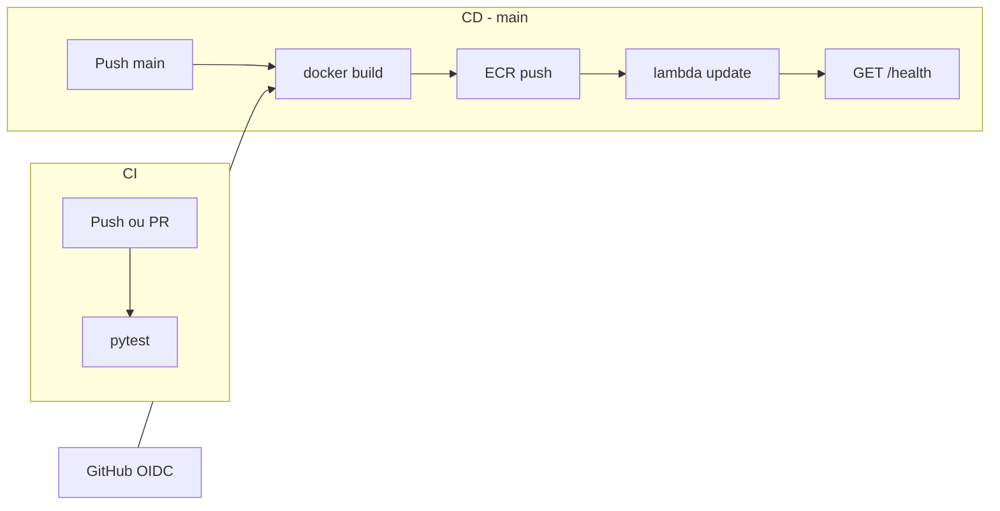

# CI/CD — GitHub Actions + AWS (OIDC)

Pipeline automatizada para testes (CI) e deploy da Lambda `gs2-api` (CD).

**Deploy manual (fallback):** [DEPLOY-LAMBDA.md](DEPLOY-LAMBDA.md)  
**Infraestrutura AWS:** [AWS-STATE wiki](https://github.com/Grupo-S-faculdade-FIAP/global-solution-2s/wiki/AWS%E2%80%90STATE)

---

## Visão geral

| Workflow | Arquivo | Trigger | O que faz |
|----------|---------|---------|-----------|
| **CI** | `.github/workflows/ci.yml` | Push e PR em qualquer branch | `pytest` com mock DynamoDB |
| **CD** | `.github/workflows/deploy-lambda.yml` | Push na `main` (paths filtrados) | Build Docker → ECR → Lambda + smoke `/health` |



**Path filter do deploy** — só dispara quando o backend Lambda muda:

- `src/app/**`
- `src/Dockerfile`
- `src/requirements-lambda.txt`
- `.github/workflows/deploy-lambda.yml`

O dashboard (`src/dashboard/`) **não** entra no deploy Lambda.

---

## Setup OIDC na AWS (uma vez)

Responsável: integrante com acesso IAM (perfil `gs2-dev` ou admin).

### 1. Identity Provider

Console AWS → **IAM** → **Identity providers** → **Add provider**:

| Campo | Valor |
|-------|-------|
| Provider type | OpenID Connect |
| Provider URL | `https://token.actions.githubusercontent.com` |
| Audience | `sts.amazonaws.com` |

### 2. IAM Role `github-actions-gs2-deploy`

**IAM** → **Roles** → **Create role** → **Web identity** → selecione o provider GitHub.

Trust policy (restringe ao repositório e branch `main`):

```json
{
  "Version": "2012-10-17",
  "Statement": [{
    "Effect": "Allow",
    "Principal": {
      "Federated": "arn:aws:iam::544785076353:oidc-provider/token.actions.githubusercontent.com"
    },
    "Action": "sts:AssumeRoleWithWebIdentity",
    "Condition": {
      "StringEquals": {
        "token.actions.githubusercontent.com:aud": "sts.amazonaws.com"
      },
      "StringLike": {
        "token.actions.githubusercontent.com:sub": "repo:Grupo-S-faculdade-FIAP/global-solution-2s:ref:refs/heads/main"
      }
    }
  }]
}
```

### 3. IAM Policy (least privilege)

Crie uma policy inline ou managed e anexe à role:

```json
{
  "Version": "2012-10-17",
  "Statement": [
    {
      "Sid": "ECRAuth",
      "Effect": "Allow",
      "Action": "ecr:GetAuthorizationToken",
      "Resource": "*"
    },
    {
      "Sid": "ECRPush",
      "Effect": "Allow",
      "Action": [
        "ecr:BatchCheckLayerAvailability",
        "ecr:InitiateLayerUpload",
        "ecr:UploadLayerPart",
        "ecr:CompleteLayerUpload",
        "ecr:PutImage"
      ],
      "Resource": "arn:aws:ecr:us-east-1:544785076353:repository/gs2-api"
    },
    {
      "Sid": "LambdaDeploy",
      "Effect": "Allow",
      "Action": [
        "lambda:UpdateFunctionCode",
        "lambda:GetFunction",
        "lambda:GetFunctionConfiguration"
      ],
      "Resource": "arn:aws:lambda:us-east-1:544785076353:function:gs2-api"
    },
    {
      "Sid": "LogsDebug",
      "Effect": "Allow",
      "Action": "logs:FilterLogEvents",
      "Resource": "arn:aws:logs:us-east-1:544785076353:log-group:/aws/lambda/gs2-api:*"
    }
  ]
}
```

Anote o ARN da role, por exemplo:

`arn:aws:iam::544785076353:role/github-actions-gs2-deploy`

### 4. Configuração no GitHub

Repositório → **Settings** → **Secrets and variables** → **Actions**:

| Nome | Tipo | Valor |
|------|------|-------|
| `AWS_ROLE_ARN` | Secret | ARN da role IAM acima |
| `AWS_REGION` | Variable | `us-east-1` |
| `AWS_ACCOUNT_ID` | Variable | `544785076353` |
| `ECR_REPOSITORY` | Variable | `gs2-api` |
| `LAMBDA_FUNCTION_NAME` | Variable | `gs2-api` |
| `API_HEALTH_URL` | Variable | `https://qqnjq8qsmh.execute-api.us-east-1.amazonaws.com/health` |

**Custo OIDC/STS:** zero. Custo operacional: minutos GitHub Actions + storage ECR existente.

---

## Workflows

### CI — testes

Roda em todo push e pull request:

```bash
cd src && PYTHONPATH=. pytest ../tests/ src/tests/ -q
```

Variáveis de ambiente no CI:

- `DYNAMODB_USE_MOCK=true` — store JSON local, sem AWS
- `MOUNT_DASHBOARD=false` — não monta Flask no import de `app.main`

Localmente, reproduza com:

```bash
make test
```

### CD — deploy Lambda

Fluxo automático na `main`:

1. Autentica via OIDC (`AssumeRoleWithWebIdentity`)
2. Login no ECR
3. `docker build` em `src/` (contexto igual ao [DEPLOY-LAMBDA.md](DEPLOY-LAMBDA.md))
4. Push com tags `:latest` e `:sha-<commit>`
5. `aws lambda update-function-code`
6. Aguarda `State=Active` e `LastUpdateStatus=Successful`
7. Smoke test: `GET /health` → `{"status":"ok"}`

A primeira build no CI pode levar 15–20 min (layers torch/YOLO). Builds seguintes usam cache de layers do Docker.

---

## Verificação pós-deploy

| Onde | O que conferir |
|------|----------------|
| GitHub → Actions | Workflow `Deploy Lambda` verde |
| AWS Lambda → gs2-api → Code | Image URI com tag `:latest` ou `:sha-...` |
| Browser / curl | `GET /health` retorna `status: ok` |
| CloudWatch Logs | `/aws/lambda/gs2-api` sem erros de cold start |

Teste opcional do pipeline CV:

```bash
aws s3 cp data/model-dataset/images/test/test-storm.jpg \
  s3://satellite-images-gs2/screenshots/test-storm.jpg \
  --region us-east-1 \
  --content-type "image/jpeg"
```

---

## Troubleshooting

| Sintoma | Causa provável | Solução |
|---------|----------------|---------|
| `Not authorized to perform sts:AssumeRoleWithWebIdentity` | Trust policy incorreta | Conferir `sub` com repo/branch exatos |
| `AccessDenied` no ECR push | Policy ECR incompleta | Incluir `GetAuthorizationToken` + ações de upload |
| `AccessDenied` no Lambda update | Policy Lambda incompleta | Adicionar `UpdateFunctionCode` na role |
| Deploy não dispara | Path filter | Mudança fora de `src/app/`, Dockerfile ou requirements-lambda |
| CI falha com `ModuleNotFoundError: app` | PYTHONPATH | Workflow usa `PYTHONPATH=.` em `src/` |
| Smoke test timeout | Cold start Lambda | Normal na 1ª invocação (~60–90 s); reexecutar workflow |
| Lambda com código antigo | Tag ECR errada | Conferir Image URI no console vs tag pushed |

---

## Recomendações

- **Branch protection:** exigir CI verde antes de merge na `main`
- **Rollback:** redeploy manual com tag `:sha-<commit-anterior>` — ver [DEPLOY-LAMBDA.md](DEPLOY-LAMBDA.md)
- **Dashboard:** continua local via `make demo` (não entra no CD)
