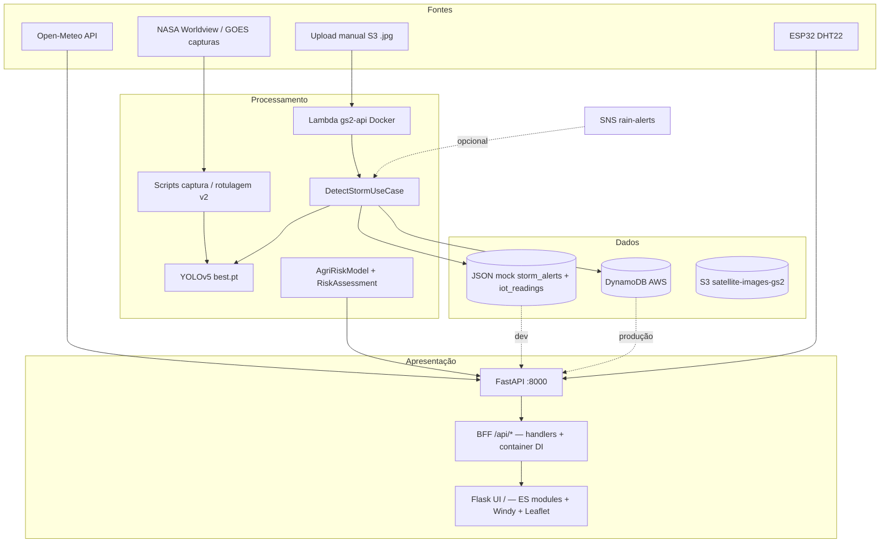

# Relatório de Progresso e Integração (RPI)

**Projeto:** GS2 — Plataforma de inteligência ambiental e agrícola (`global-solutions`)  
**Disciplina / entrega:** Global Solution (Graduação ON em IA) — FIAP 2026.1  
**Versão do documento:** 1.4  
**Data:** 05/06/2026  
**Repositório:** [Grupo-S-faculdade-FIAP/global-solution-2s](https://github.com/Grupo-S-faculdade-FIAP/global-solution-2s)

> Documento de status factual, baseado no código, README, `.specs/project/*` e evidências verificáveis no repositório. Itens não confirmados no código estão marcados como **incerto** ou **pendente**.

---

## 1. Identificação do projeto

### 1.1 Visão

Plataforma que combina **imagens de satélite (NASA GOES / capturas)**, **visão computacional (YOLOv5)**, **dados climáticos (Open-Meteo)**, **modelo de risco agrícola (ML + INMET)**, **sensores IoT (ESP32)** e **dashboard web** para monitorar padrões de nuvens convectivas/tempestades e apoiar decisões no campo — com pipeline na **AWS** (S3 → Lambda → DynamoDB / SNS) e **CI/CD** via GitHub Actions (OIDC).

### 1.2 Equipe

| Nome | E-mail | Foco principal (documentado) |
|------|--------|------------------------------|
| Caroline de Castro Corrêa | castrocaroline11@gmail.com | Análise de dados, gráficos de alertas, dashboard frontend, code review |
| Rodrigo Dias Figueiroa | rdfigueiroa@gmail.com | IoT / ESP32 — firmware, integração API, seção dashboard |
| Enzo França Sader | efr4nca03@gmail.com | Vídeo de demonstração (≤ 5 min) |
| Lucas Hideki Oliveira Koyama | lucaskoyamahhh@gmail.com | YOLO, pipeline NASA, AWS, README |
| Tiago Lindgren Curi | shopper.tiago@gmail.com | Code review, orientação AWS, CI/CD |

**Tutor(a):** Sabrina Otoni · **Coordenador(a):** Andre Godoi

### 1.3 Objetivos (G1–G5) — status

| ID | Objetivo | Critério (PROJECT.md) | Status | Evidência / observação |
|----|----------|----------------------|--------|-------------------------|
| **G1** | Detectar tempestades / nuvens chuvosas em imagens de satélite com YOLO | Precisão ≥ **70%** no conjunto de validação | **Parcial** | Pipeline v1 (limiar 200 / área 600) gerou **bboxes fantasma** — mAP@0.5 ≈ 0,55 era artefato de UI, não nuvens. Pipeline v2 (letterbox 640 + máscara UI, audit gate): **0 ghost**; retreino `storm-detector-v2` (dataset v2.1): P≈0,27, R≈0,17, mAP@0.5≈0,14 — labels honestos, **abaixo** do 70% do PROJECT.md. Pesos: `src/models/weights/best.pt` (~14 MB). |
| **G2** | Prever risco agrícola com ML + clima | Modelo + API | **Concluído (MVP+)** | `AgriRiskModel` treinado com **INMET BDMEP** (43,8k registros horários, 5 estações); contexto FAOSTAT em `docs/dados/FAOSTAT_BR_contexto.md`; `RiskAssessmentService`, `/risk/forecast`, `/ml/predict/agricultural-risk`. |
| **G3** | Visualizar clima em tempo real no dashboard | Windy API no frontend | **Concluído (demo)** | Widget **Windy** (radar) + **Open-Meteo** via API; mapa regional **Leaflet** com `/map/overlay`. REST Windy não usada (plano free). |
| **G4** | ESP32 → pipeline cloud AWS | Leituras persistidas | **Concluído (MVP)** | `POST /iot/readings`, `GET /iot/readings/latest`, store mock JSON + DynamoDB via DI; firmware `src/iot/firmware.cpp`; seção IoT no dashboard; BFF `/api/iot/*`; **11** testes em `tests/test_iot_readings.py`. |
| **G5** | MVP documentado + vídeo ≤ 5 min | Entrega FIAP | **Parcial** | Código MVP ~95% (CHECKLIST); **PDF** e **vídeo** pendentes (ação humana). |

**Nome comercial do produto:** ainda **não definido** (decisão D-001 em STATE.md).

---

## 2. Escopo e entregáveis MVP

### 2.1 Dentro do escopo (v1)

| Entregável | Status |
|------------|--------|
| Pipeline CV: captura NASA, conversão YOLO v2, treino, inferência local e na Lambda | Concluído / parcial AWS |
| API FastAPI (clima, tempestades, risco, analytics, IoT) + BFF `/api/*` para o dashboard | Concluído |
| Dashboard produtor (HTML/JS ES modules + BFF `/api/*` no FastAPI, UI Flask montada em `/`, porta única) | Concluído |
| Mock DynamoDB local (`DYNAMODB_USE_MOCK=true` no `.env`) + seed de alertas e leituras IoT | Concluído |
| Módulo IoT ESP32 (firmware + API + UI) | Concluído (MVP) |
| Arquitetura limpa enxuta (Domain → Application → Infrastructure → Interfaces) | Concluído |
| CI/CD GitHub Actions + OIDC (sem access keys) | Concluído |
| Deploy AWS: API Gateway + Lambda Docker + S3 trigger + SNS | Parcial (documentado, smoke manual) |
| README + estrutura template TIAO-2026 | Parcial (faltam screenshot/diagrama no README) |
| PDF FIAP + vídeo YouTube não listado | Pendente |

### 2.2 Fora do escopo (v1)

- App mobile nativo  
- Integração ERP agrícola  
- Cobertura fora do Brasil (v1)  
- SLA de produção  
- IoT em produção com múltiplos dispositivos / telemetria contínua (MVP cobre 1 ESP32 + persistência)

### 2.3 Artefatos de entrega FIAP

| Artefato | Caminho / referência | Status |
|----------|----------------------|--------|
| Repositório + README | `README.md` | Parcial |
| Checklist interno | `.specs/project/CHECKLIST_ENTREGA.md` | Atualizado (05/06) |
| Guia de avaliação (cobertura de rubrica) | `docs/GUIA-DE-AVALIACAO.md` | Existe |
| Deploy Lambda | `docs/DEPLOY-LAMBDA.md` | Existe |
| CI/CD GitHub Actions | `docs/CI-CD.md` | Existe |
| Wiki AWS (time) | link no README | Externo |
| PDF estruturado (Intro, Desenvolvimento, Resultados, Conclusão) | — | Pendente |
| Vídeo ≤ 5 min | link no README | Pendente |

**Template RPI FIAP:** este arquivo (`docs/RPI.md`) consolida status, arquitetura e evidências. A estrutura do repo segue o template **TIAO-2026** (pastas `docs/`, `data/`, `assets/`, `src/`).

---

## 3. Arquitetura geral

### 3.1 Visão lógica



### 3.2 Camadas (Clean Architecture enxuta)

| Camada | Responsabilidade | Localização |
|--------|------------------|-------------|
| **Domain** | Ports (interfaces de repositório) | `src/app/domain/cv/ports.py`, `domain/iot/ports.py` |
| **Application** | Use cases (lógica de negócio) | `src/app/application/cv/detect_storm.py` |
| **Infrastructure** | Adapters DynamoDB + JSON mock | `src/app/infrastructure/aws/`, `infrastructure/persistence/` |
| **Interfaces** | HTTP BFF, eventos S3 | `src/app/interfaces/http/bff/`, `interfaces/events/s3_trigger.py` |
| **DI** | Wiring mock ↔ produção | `src/app/container.py` (`get_storm_repo`, `get_iot_repo`) |
| **Routers** | Rotas HTTP finas (sem boto3/torch) | `src/app/routers/` |

### 3.3 Componentes principais

| Camada | Tecnologia | Localização |
|--------|------------|-------------|
| API | FastAPI 0.1, Mangum (Lambda) | `src/app/main.py`, routers em `src/app/routers/` |
| CV | YOLOv5 (PyTorch Hub), OpenCV | `application/cv/detect_storm.py`, `services/storm_detector.py`, `src/models/stormdetector.py` |
| ML risco | scikit-learn Random Forest + INMET | `src/app/services/agri_risk_model.py`, `risk_assessment.py`, `clients/inmet.py` |
| Clima | Open-Meteo (sem API key) | `src/app/clients/openmeteo.py`, `weather_service.py` |
| Alertas | DynamoDB ou JSON mock | `storm_alerts_store.py`, `data/demo/storm_alerts.json` |
| IoT | DynamoDB ou JSON mock | `iot_readings_store.py`, `data/demo/iot_readings.json` |
| Dashboard UI | Flask + Jinja partials + ES modules | `src/dashboard/app.py`, `templates/`, `static/js/{core,maps,sections}/` |
| BFF dashboard | FastAPI `/api/*` + handlers compartilhados | `src/app/routers/dashboard_bff.py`, `src/dashboard/bff_handlers.py`; canônico em `interfaces/http/bff/` |
| IoT firmware | C++ Arduino (ESP32 + DHT22) | `src/iot/firmware.cpp`, `src/iot/README.md` |
| Cloud | Lambda container, API Gateway, S3, SNS | `src/Dockerfile`, S3 trigger, `docs/DEPLOY-LAMBDA.md` |
| CI/CD | GitHub Actions + OIDC | `.github/workflows/ci.yml`, `deploy-lambda.yml`, `docs/CI-CD.md` |

### 3.4 Demo local (porta única)

```bash
make demo
# http://127.0.0.1:8000 — FastAPI + dashboard no mesmo processo
```

Variáveis relevantes (`.env.example` na raiz): `DYNAMODB_USE_MOCK`, `DEMO_MODE`, buckets S3, SNS, tabelas DynamoDB.

- **Mock local (recomendado para demo/vídeo):** `DYNAMODB_USE_MOCK=true` no `.env` → JSON em `data/demo/`.
- **Default no código** (`config.py`): `DYNAMODB_USE_MOCK=false` — exige AWS ou `.env` explícito.

Rotas `/api/*` registradas no **FastAPI** (prioridade); Flask espelha as mesmas rotas como fallback. Lógica única em `bff_handlers.py`.

### 3.5 Frontend dashboard (refatoração 2026-06-05)

| Módulo | Função |
|--------|--------|
| `app.js` | Entry point ES modules |
| `core/events.js` | Event bus (desacoplamento maps ↔ sections) |
| `core/orchestrator.js` | Orquestração de carregamento |
| `core/api/endpoints.js` | URLs BFF centralizadas |
| `sections/iot.js` | Card leituras + histórico IoT |
| `maps/{region,windy,location}.js` | Mapas Leaflet, Windy, localização |

Documentação de convenções: `.specs/codebase/CONVENTIONS.md`, `INTEGRATIONS.md`.

---

## 4. Status por módulo

Escala sugerida: **Concluído** · **Em progresso** · **Pendente** · **Fora do escopo MVP**

| Módulo | % estimado | Status | Resumo factual |
|--------|------------|--------|----------------|
| **Visão computacional (YOLO)** | ~80% | Em progresso | 93 capturas NASA; 79 img + 79 labels em `train`. Pipeline v2 sem ghost bboxes; mAP@0.5 ≈ 0,14 (honesto). Endpoints CV + `DetectStormUseCase` + inferência Lambda. G1 (70%) não atingido. |
| **ML risco agrícola** | ~90% | Concluído (MVP) | Modelo INMET + serviço combinando clima, CV e ML. FAOSTAT como contexto econômico. |
| **Ingestão clima (Open-Meteo)** | ~95% | Concluído | `WeatherService`, `GET /weather/current`, Lambda `ingest_weather.py` + testes. |
| **Dashboard / UX produtor** | ~98% | Concluído | Tema claro/escuro, ES modules, event bus, location-bar com grid, três mapas (região, radar Windy, picker), seção IoT, skeleton KPIs, a11y básica. |
| **IoT ESP32** | ~75% | Concluído (MVP) | Router `/iot/*`, store mock+DynamoDB, firmware `src/iot/firmware.cpp`, dashboard `sections/iot.js`, BFF `/api/iot/*`. Simulação Wokwi documentada. |
| **AWS (Lambda, S3, DynamoDB, SNS)** | ~65% | Em progresso | API publicada (`/health`); pipeline S3→Lambda documentado; CI/CD OIDC; DynamoDB real requer `DYNAMODB_USE_MOCK=false`. EventBridge captura NASA pausado. |
| **Testes automatizados** | ~90% | Concluído (MVP) | **89** testes coletados; **89 passed** (`make test`). CI em `.github/workflows/ci.yml`. |
| **CI/CD** | ~90% | Concluído | CI em todo push/PR; CD na `main` (build Docker → ECR → Lambda + smoke `/health`). Sem access keys (OIDC). |

### 4.1 Endpoints principais (evidência)

**API REST** (`data_integration`, `cv`, `ml`, `iot`):

| Método | Rota | Função |
|--------|------|--------|
| GET | `/health` | Saúde da API |
| GET | `/weather/current` | Clima Open-Meteo |
| GET | `/storms/recent` | Últimas detecções / alertas |
| GET | `/map/overlay` | GeoJSON para mapa |
| GET | `/risk/forecast` | Risco agrícola integrado |
| GET | `/alerts/weekly`, `/hourly`, `/daily`, `/heatmap`, `/summary` | Analytics de alertas |
| GET | `/alerts/status` | Status do store (mock vs AWS) |
| GET | `/dashboard/summary` | KPIs agregados |
| POST | `/alerts/simulate` | Seed de alerta (mock) |
| GET | `/cv/status`, POST `/cv/detect/storm` | Módulo CV |
| GET/POST | `/ml/predict/agricultural-risk`, `/ml/status` | ML risco agrícola |
| GET | `/iot/status` | Status módulo IoT |
| POST | `/iot/readings` | Recebe leitura ESP32 |
| GET | `/iot/readings/latest` | Leituras recentes (horas + limit) |

**BFF do dashboard** (consumido pelo `index.html`; prefixo `/api`):

| Método | Rota BFF | Espelho / extras |
|--------|----------|------------------|
| GET | `/api/dashboard/config` | Config demo + coordenadas padrão |
| GET | `/api/alerts/*`, `/api/dashboard/summary` | Mesmos dados da API REST |
| GET | `/api/weather/current`, `/api/risk/forecast`, `/api/storms/recent`, `/api/map/overlay` | Proxy in-process |
| GET | `/api/storms/detector-status`, `/api/cv/status`, `/api/ml/agricultural-risk` | Status CV/ML para UI |
| GET | `/api/nasa/capturas` | Galeria de capturas NASA |
| GET | `/api/iot/status`, `/api/iot/readings/latest` | Status e leituras IoT |
| POST | `/api/storms/detect`, `/api/storms/batch-detect`, `/api/storms/detect-sample` | Inferência YOLO na demo |
| POST | `/api/alerts/simulate-detection` | Simula detecção + alerta |

Documentação interativa: `http://127.0.0.1:8000/docs` (local). UI produtor: `http://127.0.0.1:8000/`.

**Produção:** `https://qqnjq8qsmh.execute-api.us-east-1.amazonaws.com/health`

---

## 5. Decisões técnicas (resumo)

| ID | Decisão | Rationale | Impacto |
|----|---------|-----------|---------|
| D-002 | FastAPI + Lambda + API Gateway | Serverless, free tier, disciplina cloud | Backend |
| D-003 / D-012 | Windy como **widget**, não REST | Plano free | Dashboard |
| D-004 | YOLOv5 via PyTorch Hub | Compatível Lambda, docs | CV |
| D-005 | Dataset NASA (+ Windy futuro) | Gratuito, cobre Brasil | Treino |
| D-008 | Open-Meteo sem API key | Simplicidade MVP | Clima |
| D-009 | DynamoDB (alertas + IoT time-series) | Serverless, TTL | Persistência |
| D-010 | Lambda para YOLO (não SageMaker) | Custo POC | CV cloud |
| D-011 | ML correlação simples / RF + INMET | Interpretável, MVP rápido | Risco |
| D-014 | pydantic-settings + `.env` | Sem segredos no código | Config |
| D-015 | CI/CD GitHub Actions + OIDC | Credenciais temporárias; deploy auto na main | Lambda gs2-api |
| D-016 | Clean Architecture enxuta (4 camadas) | Testabilidade; troca mock↔DynamoDB via `container.py` | Toda a API |
| D-017 | BFF shim: `dashboard/` canônico, `interfaces/http/bff/` re-exporta | Backward compat com testes | BFF |
| D-018 | `DetectStormUseCase` — routers sem boto3/torch | Separação HTTP vs pipeline | CV |
| D-019 | Pipeline labels YOLO v2 (letterbox 640 + UI mask + audit gate) | v1 tinha 74/76 bboxes fantasma | CV / dataset |
| D-020 | Frontend ES modules + partials Jinja + event bus | Manutenibilidade; maps↔sections desacoplados | Dashboard |
| — | Porta única :8000 (Flask montado no FastAPI) | UX demo, `make demo` | Dashboard |
| — | `DYNAMODB_USE_MOCK=true` no `.env` para demo local | Demo sem AWS | Dev / vídeo |

Detalhes completos: `.specs/project/STATE.md`.

---

## 6. Riscos e mitigações

| Risco | Probabilidade | Impacto | Mitigação |
|-------|---------------|---------|-----------|
| G1 não atinge 70% de validação | Alta | Avaliação rubrica | Pipeline v2 com labels honestos; plano de mais dados NASA / ajuste hiperparâmetros rotulagem (limiar 175 / area 50 → 285 bboxes) |
| DynamoDB AWS não integrado na demo | Média | Credibilidade “cloud” | `DYNAMODB_USE_MOCK=false` + smoke S3→Lambda; mock documentado; `scripts/smoke_aws_e2e.py` |
| Cold start Lambda 60–90 s | Alta | Demo ao vivo | Aquecer container antes; mostrar demo local no vídeo |
| Vídeo/PDF atrasados | Média | Nota entrega FIAP | Roteiro em CHECKLIST_ENTREGA; `make demo` estável; IoT e dashboard prontos para gravação |
| Nome do projeto indefinido | Baixa | Identidade PDF | Decidir na equipe (D-001) |
| YOLO v2 mAP baixo após correção de labels | Média | Expectativa de métricas | Documentar trade-off honestidade vs v1 inflado; focar recall e pipeline end-to-end na demo |

---

## 7. Próximos passos

### 7.1 Fase C — AWS (gs-closure)

- [ ] `DYNAMODB_USE_MOCK=false` e validar tabelas reais (alertas + IoT)  
- [ ] Smoke end-to-end: S3 → Lambda → DynamoDB → SNS (README §3 / `make smoke-aws`)  
- [ ] Republicar `best.pt` na Lambda (`docs/DEPLOY-LAMBDA.md`)  
- [ ] Retreino YOLO com dataset v2.1 completo (285 bboxes) e validar mAP  
- [ ] (Opcional) EventBridge + `capture_nasa_data.py` periódico — **substituído por** `.github/workflows/nasa-capture.yml` (cron 6 h)

### 7.2 Fase D — dashboard-producer-ready

- [x] Tema dia/noite completo (Chart.js, heatmap, Leaflet, `theme-color`, preferência do SO)
- [x] Polish visual GitHub-like (ícones, skeleton, sliders, chip de fonte)
- [x] Estados de erro por seção + `focus-visible` + `prefers-reduced-motion`
- [x] Refatoração frontend ES modules + event bus + orchestrator
- [x] Seção IoT (card leituras + histórico)
- [x] Location-bar grid + sticky compacto + nav mobile
- [ ] Screenshots dark/light no README (`docs/assets/dashboard-dark.png`, `docs/assets/dashboard-light.png`)
- [ ] Confirmar KPIs com `DEMO_MODE=false` + API obrigatória  

**Checklist manual (vídeo FIAP / UAT):**

1. `make demo` → http://127.0.0.1:8000/
2. Alternar tema (topbar) — KPIs, cards, gráficos, heatmap e mapas acompanham
3. F5 — tema persiste (`dashboard-theme` no `localStorage`)
4. Redimensionar mobile (~390px) — heatmap scrollável, topbar legível
5. Windy carrega ao rolar até a seção radar
6. Seção IoT exibe leituras (`/api/iot/readings/latest`)
7. (Opcional) `DEMO_MODE=false` — botões de dev ocultos, chip “Dados reais”
8. (Opcional) `POST /iot/readings` com payload ESP32 — verificar persistência

### 7.3 Entrega FIAP (ação humana)

- [ ] Vídeo ≤ 5 min (Enzo) — roteiro em `.specs/project/CHECKLIST_ENTREGA.md`  
- [ ] PDF (Intro, Desenvolvimento, Resultados, Conclusão)  
- [ ] Link do vídeo no README  
- [ ] Verificar prazo exato na plataforma FIAP (**incerto** em STATE todos)  

### 7.4 Pós-MVP (v2 — ROADMAP)

- ML com histórico Open-Meteo real  
- `/alerts/subscribe`  
- Mais imagens Windy com rótulo revisado  
- YOLO mAP ≥ 70% (G1)  
- IoT multi-dispositivo + alertas push  

---

## 8. Evidências

### 8.1 Métricas YOLO

| Fase | mAP@0.5 | Precision | Recall | Observação |
|------|---------|-----------|--------|------------|
| v1 (limiar 200 / área 600) | ≈ 0,55 | ~0,89 | ~0,42 | **Corrompido** — 74/76 bboxes fantasma (artefato UI) |
| v2.0 (76 bboxes honestos) | ≈ 0,078 | ~0,003 | ~0,688 | Labels corretos, dataset esparso |
| v2.1 / `storm-detector-v2` (285 bboxes) | ≈ 0,14 | ~0,27 | ~0,17 | mAP quase dobrou; ainda abaixo G1 (70%) |

Hiperparâmetros rotulagem v2: `--limiar 185 --area 80` (base); v2.1: limiar 175 / area 50.  
Confiança inferência Lambda/demo: 0,035–0,45 (contexto).  
Pesos atuais: `src/models/weights/best.pt` (~14 MB).

### 8.2 Contagens no repositório (05/06/2026)

| Recurso | Quantidade |
|---------|------------|
| `data/nasa_captures` (*.png) | 93 |
| `data/model-dataset/images/train` | 79 |
| `data/model-dataset/labels/train` | 79 |
| `src/models/weights/best.pt` | presente (~14 MB) |
| `tests/` (pytest) | 89 coletados, 89 passed (`make test`) |
| `src/iot/firmware.cpp` | presente |
| `data/demo/iot_readings.json` | presente (mock) |

### 8.3 Como reproduzir

```bash
# Demo integrada (API + dashboard + BFF /api/*)
make demo
# http://127.0.0.1:8000/ — UI  |  http://127.0.0.1:8000/docs — OpenAPI

# Testes (mesmo comando do CI)
make test
# ou: cd src && PYTHONPATH=. ../.venv/bin/pytest ../tests/ tests/ -q

# Atalhos Makefile
make test-api
make test-storms

# Smoke AWS (requer credenciais + .env)
make smoke-aws

# Pipeline agrícola (INMET + FAOSTAT + retreino ML)
make build-agri

# Apenas INMET ou só retreino
make fetch-inmet
make train-ml-inmet

# Detecção local YOLO
cd src && python models/stormdetector.py

# IoT — simular leitura ESP32
curl -X POST http://127.0.0.1:8000/iot/readings \
  -H "Content-Type: application/json" \
  -d '{"device_id":"esp32_01","cidade":"São Paulo","temperatura":24.5,"umidade":68.0}'

# Saúde local e nuvem
curl http://127.0.0.1:8000/health
curl https://qqnjq8qsmh.execute-api.us-east-1.amazonaws.com/health
```

### 8.4 Completude estimada (CHECKLIST_ENTREGA)

| Área | % |
|------|---|
| Código MVP | ~95% |
| Entrega FIAP completa (código + vídeo + PDF) | ~72% |
| Lucas (código) | ~90% |
| Carol (código) | ~98% |
| Rodrigo (IoT) | ~75% |
| Enzo (vídeo) | 0% |

---

## 9. Cronograma e marcos

Fonte: `.specs/project/ROADMAP.md` (atualizado 05/06/2026)

| Marco | Prazo | Status |
|-------|-------|--------|
| v1 MVP POC integrado | Prazo FIAP 2026.1 (**data exata: incerto**) | Em fechamento |
| YOLO NASA pipeline v2 (labels honestos) | v1 | Concluído |
| Dashboard + `make demo` + ES modules | v1 | Concluído |
| IoT ESP32 MVP (API + firmware + UI) | v1 | Concluído |
| DynamoDB mock local | v1 | Concluído |
| CI/CD GitHub Actions OIDC | v1 | Concluído |
| Backend Lambda scaffold | v1 | Parcial |
| PDF + vídeo | v1 | Pendente |
| YOLO mAP ≥ 70% (G1) | v2 | Pendente |

---

## 10. Referências internas

| Documento | Caminho |
|-----------|---------|
| Visão e metas G1–G5 | `.specs/project/PROJECT.md` |
| Estado e decisões | `.specs/project/STATE.md` |
| Roadmap | `.specs/project/ROADMAP.md` |
| Checklist entrega | `.specs/project/CHECKLIST_ENTREGA.md` |
| Feature fechamento GS | `.specs/features/gs-closure/spec.md` |
| Convenções frontend/backend | `.specs/codebase/CONVENTIONS.md` |
| Integrações externas | `.specs/codebase/INTEGRATIONS.md` |
| README operacional | `README.md` |
| Deploy Lambda | `docs/DEPLOY-LAMBDA.md` |
| CI/CD GitHub Actions | `docs/CI-CD.md` |
| IoT ESP32 | `src/iot/README.md` |
| Guia rubrica FIAP | `docs/GUIA-DE-AVALIACAO.md` |
| RPI (este documento) | `docs/RPI.md` |
| Instruções Claude Code | `CLAUDE.md` (referencia `.cursor/rules/tlc-spec-driven.mdc`) |

---

## Histórico de revisões

| Versão | Data | Autor | Alteração |
|--------|------|-------|-----------|
| 1.0 | 04/06/2026 | Agente / equipe GS2 | Criação inicial do RPI |
| 1.1 | 04/06/2026 | Agente / equipe GS2 | BFF FastAPI (`dashboard_bff`), handlers compartilhados, endpoints `/api/*`, testes 54/1 erro, `CLAUDE.md`, env `DEMO_MODE`/`BFF_INPROCESS` |
| 1.2 | 04/06/2026 | Agente / equipe GS2 | Dashboard UI profissional: tema claro/escuro, tokens CSS, polish GitHub-like, a11y, checklist Fase D |
| 1.3 | 05/06/2026 | Agente / equipe GS2 | IoT MVP (API + firmware + dashboard); Clean Architecture (Domain/Application/Infrastructure/Interfaces); pipeline YOLO v2 e métricas honestas; frontend ES modules + event bus; 84 testes passing; CI/CD OIDC (`docs/CI-CD.md`); G4 concluído MVP |
| 1.4 | 05/06/2026 | Agente / equipe GS2 | Auditoria documentação: specs, codebase docs, README, CHECKLIST, ROADMAP alinhados ao código; 89 testes; removidas refs Streamlit/IoT stub/CI manual; `.env` canônico na raiz |
