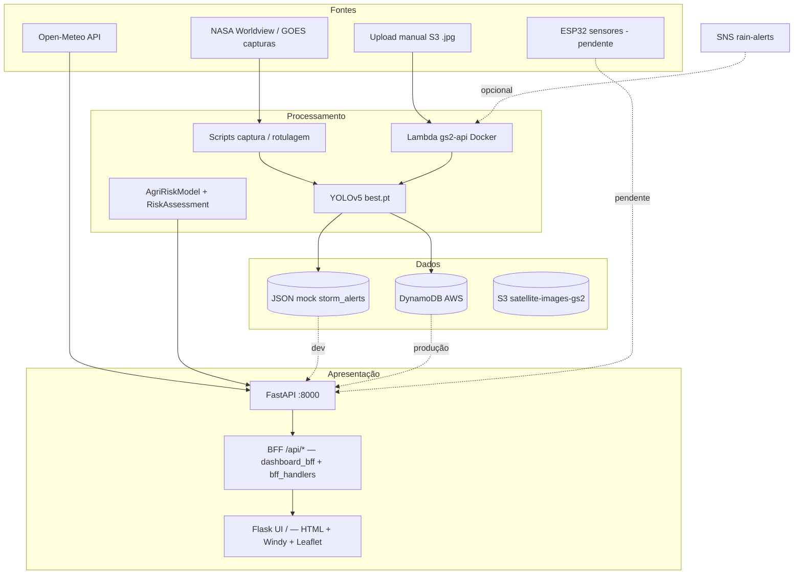

# Relatório de Progresso e Integração (RPI)

**Projeto:** GS2 — Plataforma de inteligência ambiental e agrícola (`global-solutions`)  
**Disciplina / entrega:** Global Solution (Graduação ON em IA) — FIAP 2026.1  
**Versão do documento:** 1.1  
**Data:** 04/06/2026  
**Repositório:** [Grupo-S-faculdade-FIAP/global-solution-2s](https://github.com/Grupo-S-faculdade-FIAP/global-solution-2s)

> Documento de status factual, baseado no código, README, `.specs/project/*` e evidências verificáveis no repositório. Itens não confirmados no código estão marcados como **incerto** ou **pendente**.

---

## 1. Identificação do projeto

### 1.1 Visão

Plataforma que combina **imagens de satélite (NASA GOES / capturas)**, **visão computacional (YOLOv5)**, **dados climáticos (Open-Meteo)**, **modelo de risco agrícola (ML)** e **dashboard web** para monitorar padrões de nuvens convectivas/tempestades e apoiar decisões no campo — com pipeline opcional na **AWS** (S3 → Lambda → DynamoDB / SNS).

### 1.2 Equipe

| Nome | E-mail | Foco principal (documentado) |
|------|--------|------------------------------|
| Caroline de Castro Corrêa | castrocaroline11@gmail.com | Análise de dados, gráficos de alertas, code review |
| Rodrigo Dias Figueiroa | rdfigueiroa@gmail.com | IoT / ESP32 (fora do checklist MVP atual) |
| Enzo França Sader | efr4nca03@gmail.com | Vídeo de demonstração (≤ 5 min) |
| Lucas Hideki Oliveira Koyama | lucaskoyamahhh@gmail.com | YOLO, pipeline NASA, AWS, README |
| Tiago Lindgren Curi | shopper.tiago@gmail.com | Code review, orientação AWS |

**Tutor(a):** Sabrina Otoni · **Coordenador(a):** Andre Godoi

### 1.3 Objetivos (G1–G5) — status

| ID | Objetivo | Critério (PROJECT.md) | Status | Evidência / observação |
|----|----------|----------------------|--------|-------------------------|
| **G1** | Detectar tempestades / nuvens chuvosas em imagens de satélite com YOLO | Precisão ≥ **70%** no conjunto de validação | **Parcial** | mAP@0.5 ≈ **0,55** (época 46, limiar 200 / área 600) — atende meta interna MVP (≥ 0,50) em ROADMAP, **abaixo** do 70% do PROJECT.md. Pesos: `src/models/weights/best.pt` (~14 MB). |
| **G2** | Prever risco agrícola com ML + clima | Modelo + API | **Concluído (MVP)** | `AgriRiskModel` (Random Forest, dados **sintéticos**), `RiskAssessmentService`, `GET /risk/forecast`, `GET /ml/predict/agricultural-risk`. |
| **G3** | Visualizar clima em tempo real no dashboard | Windy API no frontend | **Parcial / concluído para demo** | Widget **Windy** (radar) + **Open-Meteo** via API; mapa regional **Leaflet** com `/map/overlay`. REST Windy não usada (plano free). |
| **G4** | ESP32 → pipeline cloud AWS | Leituras persistidas | **Pendente** | Router `/iot/*` com stubs (`stored: false`). Fora do checklist de entrega atual. |
| **G5** | MVP documentado + vídeo ≤ 5 min | Entrega FIAP | **Parcial** | Código MVP ~92% (CHECKLIST); **PDF** e **vídeo** pendentes (ação humana). |

**Nome comercial do produto:** ainda **não definido** (decisão D-001 em STATE.md).

---

## 2. Escopo e entregáveis MVP

### 2.1 Dentro do escopo (v1)

| Entregável | Status |
|------------|--------|
| Pipeline CV: captura NASA, conversão YOLO, treino, inferência local e na Lambda | Concluído / parcial AWS |
| API FastAPI (clima, tempestades, risco, analytics) + BFF `/api/*` para o dashboard | Concluído |
| Dashboard produtor (HTML/JS + BFF `/api/*` no FastAPI, UI Flask montada em `/`, porta única) | Concluído |
| Mock DynamoDB local (`DYNAMODB_USE_MOCK=true`) + seed de alertas | Concluído |
| Deploy AWS: API Gateway + Lambda Docker + S3 trigger + SNS | Parcial (documentado, smoke manual) |
| README + estrutura template TIAO-2026 | Parcial (faltam screenshot/diagrama no README) |
| PDF FIAP + vídeo YouTube não listado | Pendente |

### 2.2 Fora do escopo (v1)

- App mobile nativo  
- Integração ERP agrícola  
- Cobertura fora do Brasil (v1)  
- SLA de produção  
- IoT ESP32 completo (P2 / Rodrigo — excluído do checklist MVP 2026-06-04)

### 2.3 Artefatos de entrega FIAP

| Artefato | Caminho / referência | Status |
|----------|----------------------|--------|
| Repositório + README | `README.md` | Parcial |
| Checklist interno | `.specs/project/CHECKLIST_ENTREGA.md` | Atualizado |
| Guia de avaliação (cobertura de rubrica) | `docs/GUIA-DE-AVALIACAO.md` | Existe |
| Deploy Lambda | `docs/DEPLOY-LAMBDA.md` | Existe |
| Wiki AWS (time) | link no README | Externo |
| PDF estruturado (Intro, Desenvolvimento, Resultados, Conclusão) | — | Pendente |
| Vídeo ≤ 5 min | link no README | Pendente |

**Template RPI FIAP:** este arquivo (`docs/RPI.md`) consolida status, arquitetura e evidências. A estrutura do repo segue o template **TIAO-2026** (pastas `docs/`, `data/`, `assets/`, `src/`).

---

## 3. Arquitetura geral

### 3.1 Visão lógica



### 3.2 Componentes principais

| Camada | Tecnologia | Localização |
|--------|------------|-------------|
| API | FastAPI 0.1, Mangum (Lambda) | `src/app/main.py`, routers em `src/app/routers/` |
| CV | YOLOv5 (PyTorch Hub), OpenCV | `src/app/services/storm_detector.py`, `src/models/stormdetector.py` |
| ML risco | scikit-learn Random Forest | `src/app/services/agri_risk_model.py`, `risk_assessment.py` |
| Clima | Open-Meteo (sem API key) | `src/app/clients/openmeteo.py`, `weather_service.py` |
| Alertas | DynamoDB ou JSON mock | `storm_alerts_store.py`, `data/demo/storm_alerts.json` |
| Dashboard UI | Flask + templates | `src/dashboard/app.py`, `templates/index.html` — montado em `/` via `WSGIMiddleware` |
| BFF dashboard | FastAPI `/api/*` + handlers compartilhados | `src/app/routers/dashboard_bff.py`, `src/dashboard/bff_handlers.py`, `bff_backend.py` |
| Cloud | Lambda container, API Gateway, S3, SNS | `src/Dockerfile`, `cv.py` S3 trigger, `docs/DEPLOY-LAMBDA.md` |

### 3.3 Demo local (porta única)

```bash
make demo
# http://127.0.0.1:8000 — FastAPI + dashboard no mesmo processo
```

Variáveis relevantes (`.env.example` na raiz): `DYNAMODB_USE_MOCK`, `DEMO_MODE`, `MOUNT_DASHBOARD`, `BFF_INPROCESS`, buckets S3, SNS.

Rotas `/api/*` registradas no **FastAPI** (prioridade); Flask espelha as mesmas rotas como fallback. Lógica única em `bff_handlers.py`.

---

## 4. Status por módulo

Escala sugerida: **Concluído** · **Em progresso** · **Pendente** · **Fora do escopo MVP**

| Módulo | % estimado | Status | Resumo factual |
|--------|------------|--------|----------------|
| **Visão computacional (YOLO)** | ~85% | Em progresso | Treino NASA (90 capturas em `data/nasa_captures`; 76 img + 76 labels em `train`). mAP@0.5 ≈ 0,55. Endpoints CV + inferência Lambda. G1 (70%) não atingido. |
| **ML risco agrícola** | ~90% | Concluído (MVP) | Modelo sintético + serviço combinando clima, CV e ML. Não há retreino com série histórica real (deferido v2). |
| **Ingestão clima (Open-Meteo)** | ~95% | Concluído | `WeatherService`, `GET /weather/current`, Lambda `ingest_weather.py` + testes. |
| **Dashboard / UX produtor** | ~95% | Concluído | UI GitHub-like com **tema claro/escuro** (`localStorage` + `prefers-color-scheme`), tokens CSS, gráficos/heatmap/mapas reativos ao toggle, skeleton KPIs, ícones Bootstrap, estados de erro e a11y básica. |
| **IoT ESP32** | ~10% | Pendente / fora MVP | Apenas `/iot/status` e stubs em `iot.py`. Sem firmware no repositório verificado. |
| **AWS (Lambda, S3, DynamoDB, SNS)** | ~60% | Em progresso | API publicada (`/health`); pipeline S3→Lambda documentado; DynamoDB real no dashboard ainda com **mock** por padrão. EventBridge captura NASA pausado. |
| **Testes automatizados** | ~75% | Em progresso | **54** testes coletados (`pytest`); **1** erro de collection em `tests/test_alerts_analytics_extended.py` (`ModuleNotFoundError: app` — falta `PYTHONPATH=src`). Makefile: `test-api`, `test-storms`. |

### 4.1 Endpoints principais (evidência)

**API REST** (`data_integration`, `cv`, `ml`, `iot`):

| Método | Rota | Função |
|--------|------|--------|
| GET | `/health` | Saúde da API |
| GET | `/weather/current` | Clima Open-Meteo |
| GET | `/storms/recent` | Últimas detecções / alertas |
| GET | `/map/overlay` | GeoJSON para mapa |
| GET | `/risk/forecast` | Risco agrícola integrado |
| GET | `/alerts/weekly`, `/hourly`, `/daily`, `/heatmap`, `/summary` | Analytics de alertas |
| GET | `/alerts/status` | Status do store (mock vs AWS) |
| GET | `/dashboard/summary` | KPIs agregados |
| POST | `/alerts/simulate` | Seed de alerta (mock) |
| GET | `/cv/status`, POST `/cv/detect/storm` | Módulo CV |
| GET/POST | `/ml/predict/agricultural-risk`, `/ml/status` | ML risco agrícola |
| GET/POST | `/iot/*` | Stubs |

**BFF do dashboard** (consumido pelo `index.html`; prefixo `/api`):

| Método | Rota BFF | Espelho / extras |
|--------|----------|------------------|
| GET | `/api/dashboard/config` | Config demo + coordenadas padrão |
| GET | `/api/alerts/*`, `/api/dashboard/summary` | Mesmos dados da API REST |
| GET | `/api/weather/current`, `/api/risk/forecast`, `/api/storms/recent`, `/api/map/overlay` | Proxy in-process (`BFF_INPROCESS`) |
| GET | `/api/storms/detector-status`, `/api/cv/status`, `/api/ml/agricultural-risk` | Status CV/ML para UI |
| GET | `/api/nasa/capturas` | Galeria de capturas NASA |
| POST | `/api/storms/detect`, `/api/storms/batch-detect`, `/api/storms/detect-sample` | Inferência YOLO na demo |
| POST | `/api/alerts/simulate-detection` | Simula detecção + alerta |

Documentação interativa: `http://127.0.0.1:8000/docs` (local). UI produtor: `http://127.0.0.1:8000/`.

**Produção:** `https://qqnjq8qsmh.execute-api.us-east-1.amazonaws.com/health`

---

## 5. Decisões técnicas (resumo)

| ID | Decisão | Rationale | Impacto |
|----|---------|-----------|---------|
| D-002 | FastAPI + Lambda + API Gateway | Serverless, free tier, disciplina cloud | Backend |
| D-003 / D-012 | Windy como **widget**, não REST | Plano free | Dashboard |
| D-004 | YOLOv5 via PyTorch Hub | Compatível Lambda, docs | CV |
| D-005 | Dataset NASA (+ Windy futuro) | Gratuito, cobre Brasil | Treino |
| D-008 | Open-Meteo sem API key | Simplicidade MVP | Clima |
| D-009 | DynamoDB (3+ tabelas planejadas) | Serverless, TTL | Persistência |
| D-010 | Lambda para YOLO (não SageMaker) | Custo POC | CV cloud |
| D-011 | ML correlação simples / RF sintético | Interpretável, MVP rápido | Risco |
| D-014 | pydantic-settings + `.env` | Sem segredos no código | Config |
| — | `DYNAMODB_USE_MOCK=true` default | Demo sem AWS | Dev / vídeo |
| — | Porta única :8000 (Flask montado no FastAPI) | UX demo, `make demo` | Dashboard |
| D-015 | BFF `/api/*` no FastAPI + `bff_handlers` compartilhado | Evita loopback HTTP; rotas BFF com prioridade sobre Flask | Dashboard |

Detalhes completos: `.specs/project/STATE.md`.

---

## 6. Riscos e mitigações

| Risco | Probabilidade | Impacto | Mitigação |
|-------|---------------|---------|-----------|
| G1 não atinge 70% de validação | Média | Avaliação rubrica | Documentar mAP@0.5 e precision/recall; plano de mais dados NASA / revisão de labels |
| DynamoDB AWS não integrado na demo | Média | Credibilidade “cloud” | Checklist “Quando AWS estiver pronta”; mock documentado; smoke S3→Lambda no README |
| Cold start Lambda 60–90 s | Alta | Demo ao vivo | Aquecer container antes; mostrar demo local no vídeo |
| IoT não entregue | Baixa (escopo) | Cobertura rubrica ESP32 | GUIA marca ESP32 como responsabilidade Rodrigo; declarar fora do MVP v1 |
| Vídeo/PDF atrasados | Média | Nota entrega FIAP | Roteiro em CHECKLIST_ENTREGA; `make demo` estável |
| Testes com erro de collection | Média | CI / qualidade | Corrigir `PYTHONPATH` ou imports em `test_alerts_analytics_extended.py` antes da entrega |
| Nome do projeto indefinido | Baixa | Identidade PDF | Decidir na equipe (D-001) |

---

## 7. Próximos passos

### 7.1 Fase C — AWS (gs-closure)

- [ ] `DYNAMODB_USE_MOCK=false` e validar tabelas reais  
- [ ] Smoke end-to-end: S3 → Lambda → DynamoDB → SNS (README §3)  
- [ ] Republicar `best.pt` na Lambda (`docs/DEPLOY-LAMBDA.md`)  
- [ ] (Opcional) EventBridge + `capture_nasa_data.py` periódico  

### 7.2 Fase D — dashboard-producer-ready

- [x] Tema dia/noite completo (Chart.js, heatmap, Leaflet, `theme-color`, preferência do SO)
- [x] Polish visual GitHub-like (ícones, skeleton, sliders, chip de fonte)
- [x] Estados de erro por seção + `focus-visible` + `prefers-reduced-motion`
- [ ] Screenshots dark/light no README (`docs/assets/dashboard-dark.png`, `docs/assets/dashboard-light.png`)
- [ ] Confirmar KPIs com `DEMO_MODE=false` + API obrigatória  

**Checklist manual (vídeo FIAP / UAT):**

1. `make demo` → http://127.0.0.1:8000/
2. Alternar tema (topbar) — KPIs, cards, gráficos, heatmap e mapas acompanham
3. F5 — tema persiste (`dashboard-theme` no `localStorage`)
4. Redimensionar mobile (~390px) — heatmap scrollável, topbar legível
5. Windy carrega ao rolar até a seção radar
6. (Opcional) `DEMO_MODE=false` — botões de dev ocultos, chip “Dados reais”

### 7.3 Entrega FIAP (ação humana)

- [ ] Vídeo ≤ 5 min (Enzo) — roteiro em `.specs/project/CHECKLIST_ENTREGA.md`  
- [ ] PDF (Intro, Desenvolvimento, Resultados, Conclusão)  
- [ ] Link do vídeo no README  
- [ ] Verificar prazo exato na plataforma FIAP (**incerto** em STATE todos)  

### 7.4 Pós-MVP (v2 — ROADMAP)

- ML com histórico Open-Meteo real  
- `/alerts/subscribe`  
- Mais imagens Windy com rótulo revisado  
- IoT ESP32 se houver tempo  

---

## 8. Evidências

### 8.1 Métricas YOLO (documentadas — não reexecutadas neste RPI)

| Métrica | Valor | Fonte |
|---------|-------|-------|
| mAP@0.5 | ≈ 0,55 (0,546 época 46) | STATE.md, README, ROADMAP |
| Precision | ~0,89 | STATE.md |
| Recall | ~0,42 | STATE.md |
| Hiperparâmetros rotulagem auto | limiar 200, área 600 | STATE.md |
| Confiança inferência Lambda/demo | 0,035–0,45 (contexto) | README, dashboard |

### 8.2 Contagens no repositório (04/06/2026)

| Recurso | Quantidade |
|---------|------------|
| `data/nasa_captures` (*.png) | 90 |
| `data/model-dataset/images/train` | 76 |
| `data/model-dataset/labels/train` | 76 |
| `src/models/weights/best.pt` | presente (~14 MB) |

> README menciona 46 imagens em status pontual de 04/06 — o filesystem atual indica **76**; usar contagem do filesystem como mais recente, salvo novo commit.

### 8.3 Como reproduzir

```bash
# Demo integrada (API + dashboard + BFF /api/*)
make demo
# http://127.0.0.1:8000/ — UI  |  http://127.0.0.1:8000/docs — OpenAPI

# Testes (PYTHONPATH=src para imports app.*)
cd src && ../.venv/bin/pytest ../tests/ tests/ -q

# Atalhos Makefile
make test-api
make test-storms

# Detecção local YOLO
cd src && python models/stormdetector.py

# Saúde local e nuvem
curl http://127.0.0.1:8000/health
curl https://qqnjq8qsmh.execute-api.us-east-1.amazonaws.com/health
```

### 8.4 Completude estimada (CHECKLIST_ENTREGA)

| Área | % |
|------|---|
| Código MVP | ~92% |
| Entrega FIAP completa (código + vídeo + PDF) | ~70% |
| Lucas (código) | ~90% |
| Carol (código) | ~95% |
| Enzo (vídeo) | 0% |

---

## 9. Cronograma e marcos

Fonte: `.specs/project/ROADMAP.md` (atualizado 04/06/2026)

| Marco | Prazo | Status |
|-------|-------|--------|
| v1 MVP POC integrado | Prazo FIAP 2026.1 (**data exata: incerto**) | Em fechamento |
| YOLO NASA mAP ≥ 0,50 | v1 | Concluído |
| Dashboard + `make demo` | v1 | Concluído |
| DynamoDB mock local | v1 | Concluído |
| Backend Lambda scaffold | v1 | Parcial |
| PDF + vídeo | v1 | Pendente |
| IoT ESP32 | P2 | Fora do escopo MVP atual |

---

## 10. Referências internas

| Documento | Caminho |
|-----------|---------|
| Visão e metas G1–G5 | `.specs/project/PROJECT.md` |
| Estado e decisões | `.specs/project/STATE.md` |
| Roadmap | `.specs/project/ROADMAP.md` |
| Checklist entrega | `.specs/project/CHECKLIST_ENTREGA.md` |
| Feature fechamento GS | `.specs/features/gs-closure/spec.md` |
| README operacional | `README.md` |
| Deploy Lambda | `docs/DEPLOY-LAMBDA.md` |
| Guia rubrica FIAP | `docs/GUIA-DE-AVALIACAO.md` |
| RPI (este documento) | `docs/RPI.md` |
| Instruções Claude Code | `CLAUDE.md` (referencia `.cursor/rules/tlc-spec-driven.mdc`) |

---

## Histórico de revisões

| Versão | Data | Autor | Alteração |
|--------|------|-------|-----------|
| 1.0 | 04/06/2026 | Agente / equipe GS2 | Criação inicial do RPI |
| 1.1 | 04/06/2026 | Agente / equipe GS2 | BFF FastAPI (`dashboard_bff`), handlers compartilhados, endpoints `/api/*`, testes 54/1 erro, `CLAUDE.md`, env `DEMO_MODE`/`BFF_INPROCESS` |
| 1.2 | 04/06/2026 | Agente / equipe GS2 | Dashboard UI profissional: tema claro/escuro, tokens CSS, polish GitHub-like, a11y, checklist Fase D |
